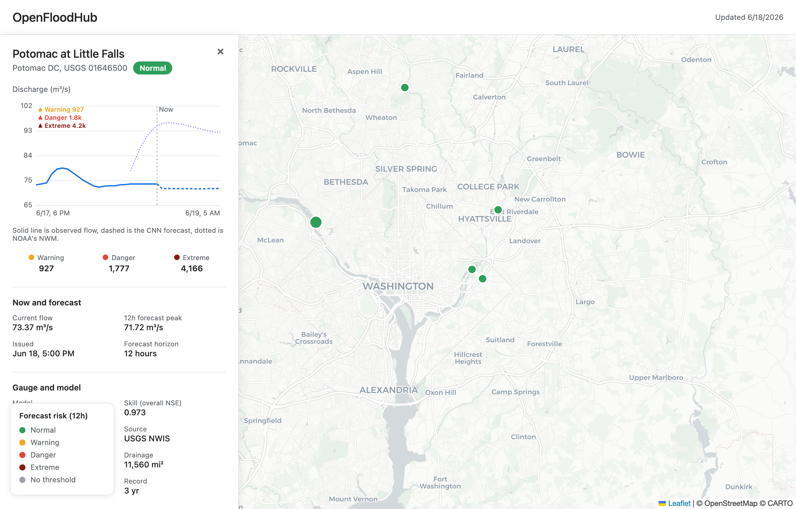

# OpenFloodHub

An open-source, self-hostable alternative to [Google Flood Hub](https://sites.research.google/floods/).

Google Flood Hub runs one global model: a single neural network, trained across thousands of basins, that predicts streamflow everywhere from one set of weights. OpenFloodHub does the opposite. It trains a separate small model for each river gauge, on that gauge's own history.

That tradeoff is the whole point of the project:

- A model that only has to learn one catchment can be tiny (about 50k parameters), train in 90 seconds on a laptop CPU, and you can actually inspect what it learned for that specific river.
- A global model generalizes to places with no gauge at all, which a per-site model cannot do. You need a few years of record for each gauge before you can train it.

So this is not a drop-in replacement for everything Flood Hub does. It is a different bet: that for a known set of gauges you care about, a specialized local model is simpler to run, cheaper to retrain, and easier to reason about than one big model trying to cover the planet.

The repo ships with a working deployment for the gauges around Washington, DC.

> **Caveat.** This is a research prototype. Do not use it to decide whether to drive through floodwater. The official sources for that are [NWS AHPS](https://water.weather.gov/ahps/) and [NOAA NWPS](https://water.noaa.gov/).

## The map

`web/` is a static map UI, styled after Flood Hub but driven by the per-site models. No build step, no backend: one HTML file, one JS file, Leaflet, and the `preds.json` the model writes.



Click a gauge to open its panel. The chart shows recent observed discharge (solid line), the local CNN's 12-hour forecast (dashed), and NOAA's National Water Model for comparison (dotted). Each gauge has its own Warning/Danger/Extreme thresholds, derived from that gauge's flood history, so the risk coloring means something different for the Potomac than it does for a 4-square-mile urban creek.

To run it locally after generating `preds.json` (see below):

```bash
cp outputs/dmv-cnn-12h/preds.json web/preds.json
cd web && python3 -m http.server 8772      # open http://localhost:8772
```

## The model

`flood_warning/model.py`. Two-branch 1D CNN: a 4-channel past stream (flow, precip, temperature, and soil moisture for the last 24 hours) and a 1-channel future stream (forecast precip for the next 12 hours). Each goes through a few Conv1D layers, gets flattened, concatenated, and projected to a 12-step output. The 4th past channel is ERA5-Land surface soil moisture — an antecedent-wetness proxy that tells the model how saturated the basin is before a storm.

```
past   (4 ch x 24h)  ->  Conv1D x 3  ->  flatten
future (1 ch x 12h)  ->  Conv1D x 2  ->  flatten
                         concat -> FC -> 12-step forecast
```

About 50k parameters. Trains per gauge in 90 seconds on CPU.

Held-out test NSE (3 years hourly, last 15% as test):

| Gauge | Drainage (mi²) | Test NSE | 12h-ahead NSE |
| --- | ---: | ---: | ---: |
| Potomac at Little Falls (DC) | 11,560 | 0.977 | 0.945 |
| Anacostia at Kenilworth (DC) | 134 | 0.694 | 0.653 |
| NE Branch Anacostia (MD) | 73 | 0.436 | 0.175 |
| Rock Creek at Sherrill Dr (DC) | 62 | 0.414 | 0.144 |
| Difficult Run (VA) | 58 | 0.352 | 0.115 |
| NW Branch Anacostia (MD) | 21 | 0.211 | 0.061 |
| Watts Branch (DC) | 3.6 | 0.123 | 0.024 |

The big mainstem gauges are basically solved at hourly resolution. The small urban catchments at the bottom of the table are hard and there's no real way around it: Watts Branch is 3.6 mi² of pavement, it responds to rain in minutes, and an hourly model is the wrong tool. Either bump to 15-minute cadence or feed it NEXRAD precip instead of point ERA5.

## Thresholds

NWS publishes flood categories mostly as gauge height (stage in feet), which a discharge model can't speak to. So `thresholds.py` derives flow thresholds (m³/s) from each gauge's own record: it takes the daily-peak distribution over the multi-year history and reads off high quantiles as return-period stand-ins (roughly 2-, 5-, and 10-year for Warning, Danger, Extreme). These are cached to `thresholds.json` and attached to every prediction.

## Layout

```
flood_warning/
├── sites.py            # the gauges + lat/lon/drainage
├── fetch.py            # USGS NWIS + Open-Meteo data fetcher
├── dataset.py          # windowing + scaler
├── model.py            # the CNN
├── train.py            # per-gauge training
├── predict.py          # live inference + 7-day backtest
├── thresholds.py       # per-gauge flood thresholds from the record
├── thresholds.json     # cached thresholds (committed)
├── noaa.py             # NOAA/NWS comparison overlays (NWM, QPF, MRMS)
├── checkpoints/        # pretrained .pt files (one per gauge)
└── requirements-ci.txt

web/                    # static map UI (index.html, app.js, preds.json)
```

## Setup

Python 3.12. Get a free USGS API key from [waterdata.usgs.gov](https://waterdata.usgs.gov) and put it in `.env.local` as `USGS_API_KEY=...`.

```bash
uv venv --python 3.12 .venv
.venv/bin/pip install -r requirements.txt
```

Cached data goes to `./data/` by default; override with `$FLOOD_DATA_DIR`. Inference writes to `./outputs/`.

## Train from scratch

```bash
.venv/bin/python -m flood_warning.fetch          # ~3 years of hourly data
for gid in 01646500 01648000 01651760 01649500 01650500 01651800 01646000; do
  .venv/bin/python -m flood_warning.train "$gid"
done                                              # ~90s per gauge on CPU
.venv/bin/python -m flood_warning.thresholds      # compute flood thresholds
```

## Run inference

```bash
.venv/bin/python -m flood_warning.predict        # writes outputs/dmv-cnn-12h/preds.json
```

`preds.json` contains, per gauge: the 12-hour-ahead CNN forecast, a 7-day hourly backtest (how the model has been tracking observed flow lately), the gauge's flood thresholds, and a set of NOAA/NWS comparison overlays. The overlays are reference series only. They ride alongside the CNN forecast and are never fed back into the model:

| Field | Source | What it is |
| --- | --- | --- |
| `noaa_nwm` | NWM short-range | Next ~18h streamflow, hourly (m³/s) |
| `noaa_nwm_medium` | NWM medium-range blend | Next ~10d streamflow, hourly (m³/s) |
| `noaa_nwm_analysis` | NWM analysis-assimilation | Recent best-estimate "observed" streamflow (m³/s) |
| `noaa_qpf` | NWS gridpoint forecast | Forecast rainfall, hourly (mm) |
| `noaa_mrms_precip` | MRMS radar QPE (via IEM) | Observed rainfall, daily (mm) |

NWM streamflow and NWS QPF come from unauthenticated NOAA APIs ([NWPS](https://api.water.noaa.gov/nwps/v1/docs/), [api.weather.gov](https://www.weather.gov/documentation/services-web-api)); MRMS observed precip is pulled per-point from the [Iowa Environmental Mesonet](https://mesonet.agron.iastate.edu/) IEMRE service.

## Adding a gauge

Add a row to `flood_warning/sites.py` with `id`, `name`, `lat`, `lon`, `drainage_sqmi`, `kind`. Then fetch, train, and compute its thresholds.

## License

[Apache 2.0](./LICENSE).
